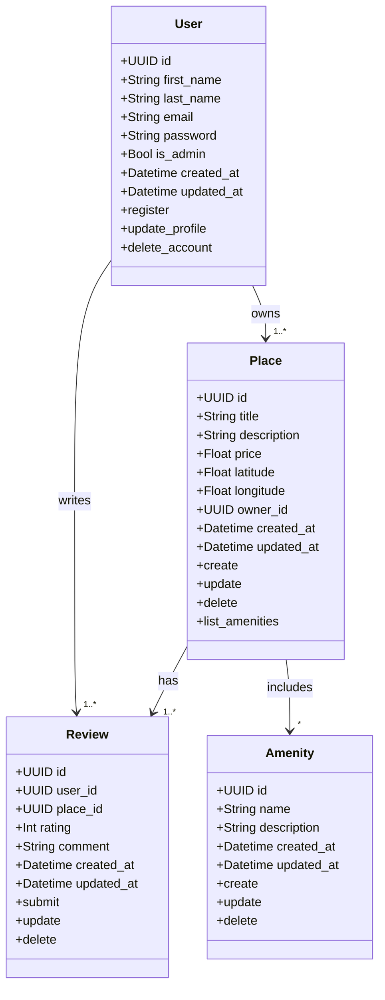

# Business Logic Layer – Class Diagram

This diagram shows the structure of the core entities in the HBnB application:

- User
- Place
- Review
- Amenity

```mermaid
classDiagram
class User {
    +UUID id
    +String first_name
    +String last_name
    +String email
    +String password
    +Bool is_admin
    +Datetime created_at
    +Datetime updated_at
    +register
    +update_profile
    +delete_account
}

class Place {
    +UUID id
    +String title
    +String description
    +Float price
    +Float latitude
    +Float longitude
    +UUID owner_id
    +Datetime created_at
    +Datetime updated_at
    +create
    +update
    +delete
    +list_amenities
}

class Review {
    +UUID id
    +UUID user_id
    +UUID place_id
    +Int rating
    +String comment
    +Datetime created_at
    +Datetime updated_at
    +submit
    +update
    +delete
}

class Amenity {
    +UUID id
    +String name
    +String description
    +Datetime created_at
    +Datetime updated_at
    +create
    +update
    +delete
}

User --> "1..*" Place : owns
User --> "1..*" Review : writes
Place --> "1..*" Review : has
Place --> "*" Amenity : includes
```
