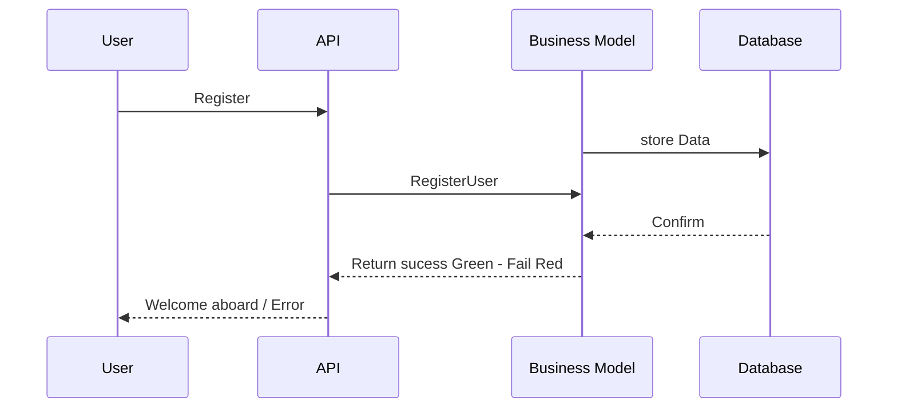

## User Registration API

```mermaid
sequenceDiagram
  participant User as User
  participant API as API
  participant BusinessModel as Business Model
  participant UserModel as Database
  User ->> API: Register
  BusinessModel ->> UserModel: store Data
  API ->> BusinessModel: RegisterUser
  UserModel -->> BusinessModel: Confirm
  BusinessModel -->> API: Return sucess Green - Fail Red
  API -->> User: Welcome aboard / Error
```

## Place Creation 

## Review Submission

## Review Submission

## Fetching a List of Places
