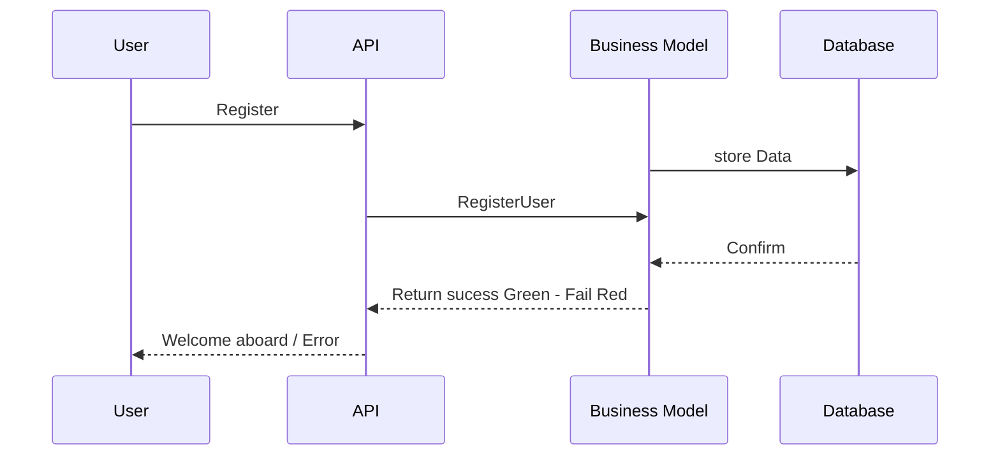
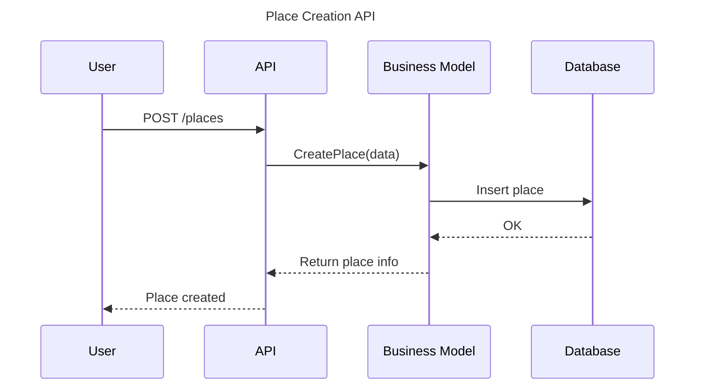
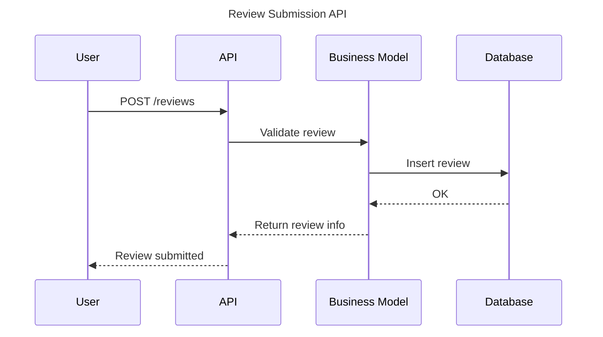
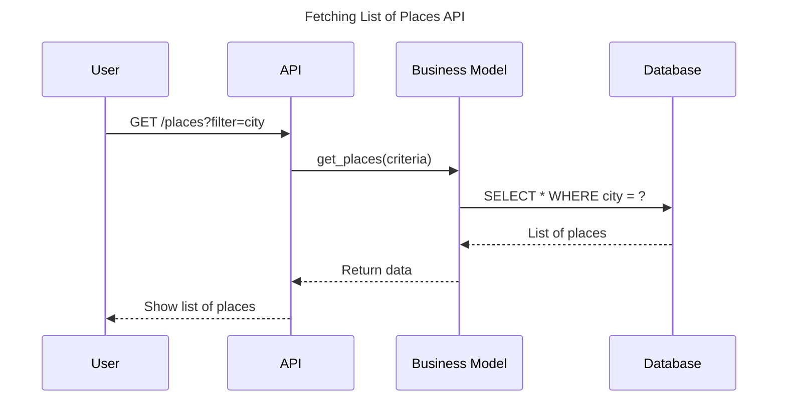

## 1. User Registration API

## 2. Place Creation API

## 3. Review Submission API

## 4. Fetching List of Places

## Place Creation 

## Review Submission

## Review Submission

## Fetching a List of Places
