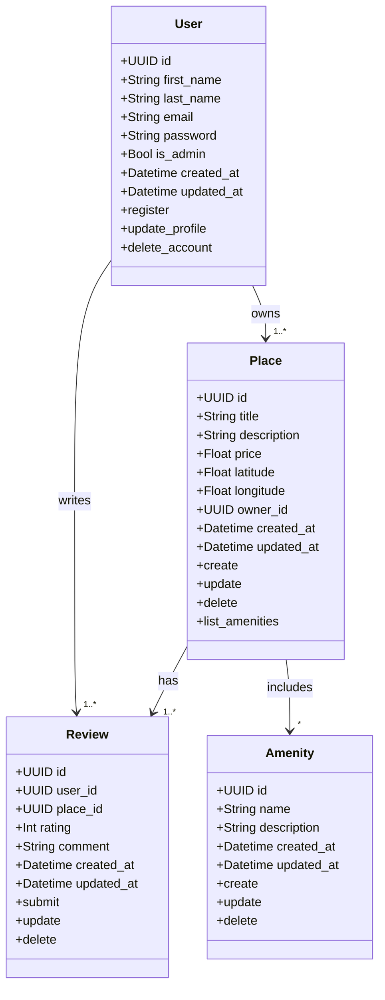

# HBnB Project - Technical Documentation

## 📌 Introduction

### 🎯 Purpose and Scope
This document aims to provide a a detailed technical guide for the **HBnB** project for the development team. It covers the overall system architecture, design, object modeling, and the flow of operations through the system layers using UML diagrams to ensuring a consistent and efficient development process.

### ⭐️ Project Overview
**HB** nB is a full-stack web application that replicates the core functionalities of a property rental platform similar to Airbnb. It allows users to create, view, and manage property listings, as well as interact with places, amenities, cities, and users.

The project is developed using a modular architecture with a strong focus on backend design, object-relational mapping, and RESTful API support. It is built as part of the Holberton School curriculum to demonstrate mastery in Python, web development, and system design.

### 📖 Document Structure
This document is structured as follows:

- **💠 High-Level Architecture**: Overview and package diagram.
- **💠 Business Logic Layer**: Class diagram and entity relationships.
- **💠 API Interaction Flow**: Sequence diagrams and data flow explanations.
- **💠 Explanatory Notes**: Design decisions and rationale.

---

## High-Level Architecture

### 🌟 Overview
HBnB follows a **layered architecture** to ensure **separation of concerns, maintainability, and scalability**. The system is divided into the following key layers:

- **✅ Presentation Layer**: Handles user interactions via a web interface. This includes all HTTP services and API endpoints.
- **✅ Business Logic Layer**: Contains core logic and models (e.g., User, Place, Review, Amenity). This layer processes requests, applies business rules, and coordinates data flow between the frontend and storage.
- **✅ Persistence Layer**: Manages data storage and retrieval.

### 📐 High-Level Package Diagram

### 💁🏻‍♀️ Explanation

- **Presentation Layer**: Exposes a RESTful API and web interface. It handles incoming HTTP requests, routes them to the appropriate logic, and returns responses.
- **Business Logic Layer**: Contains the core classes and logic (e.g., User, Place, Review, Amenity) that enforce business rules, validate data, and orchestrate interactions between layers.
- **Data Access Layer**: Abstracts how data is stored and retrieved.

---

## Business Logic Layer

### 📐 Class Diagram

### 🔑 Key Entities and Their Relationships
- **User**: Represents a person using the platform. Can be a regular user or an admin. Users can own places and leave reviews.
- **Place**: Represents a property listed by a user. Contains attributes like title, description, price, and location.
- **Review**: Stores feedback and ratings left by users on places. Each review is linked to a user and a place.
- **Amenity**: Represents features (e.g., Wi-Fi, pool) that can be associated with places.

### 📌 Design Considerations
- **Use of inheritance** Common attributes such as id, created_at, and updated_at are abstracted in a BaseModel.
- **Encapsulation** Data is accessed and modified through methods to maintain integrity and control.
- **Associations** **One-to-many between User and Place **One-to-many between Place and Review **Many-to-many between Place and Amenity

---
